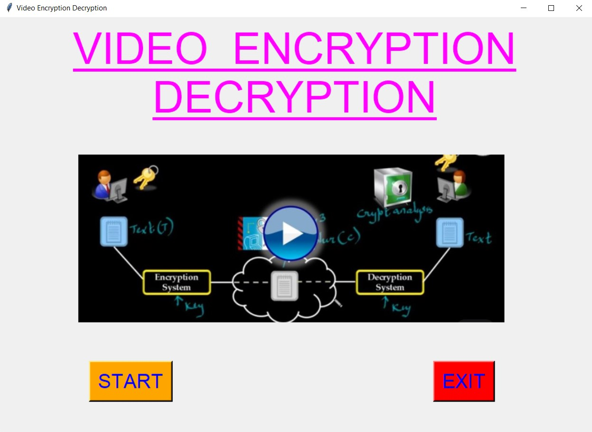
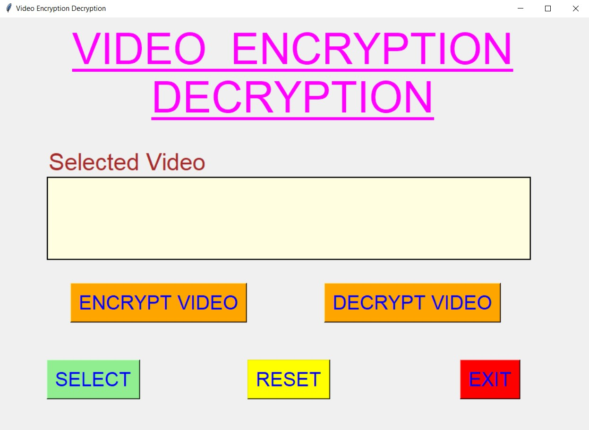
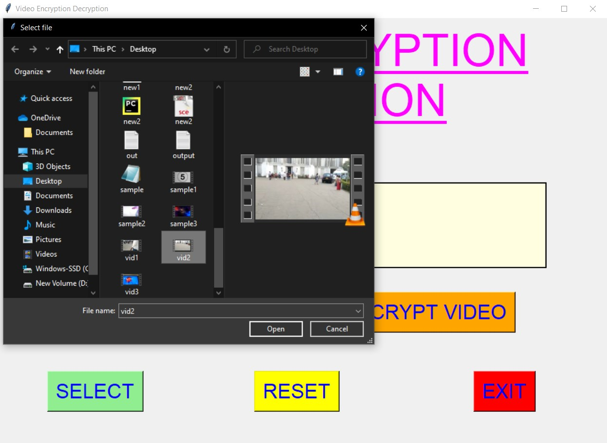
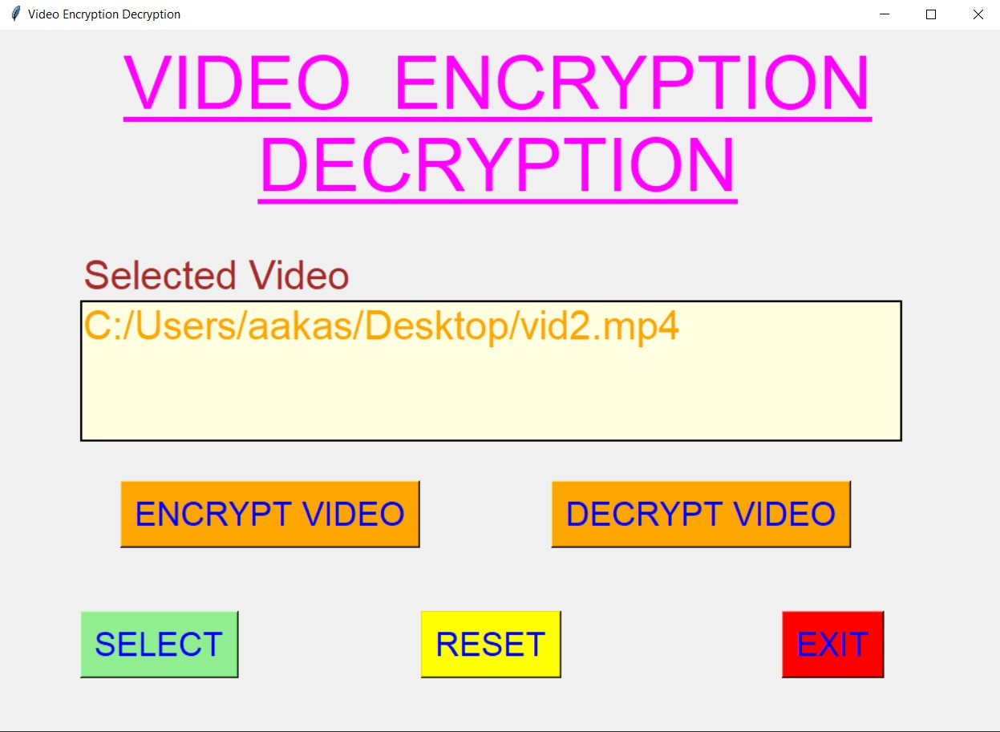
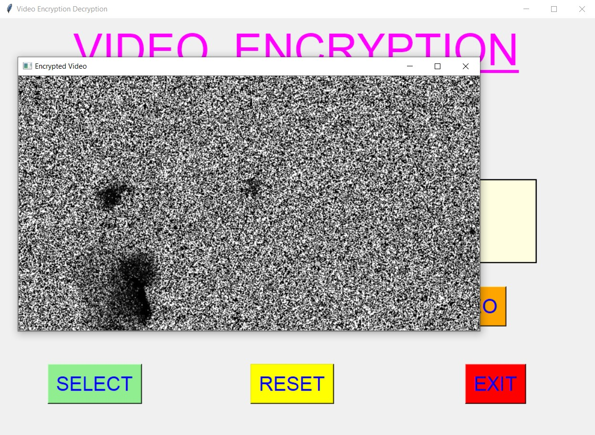
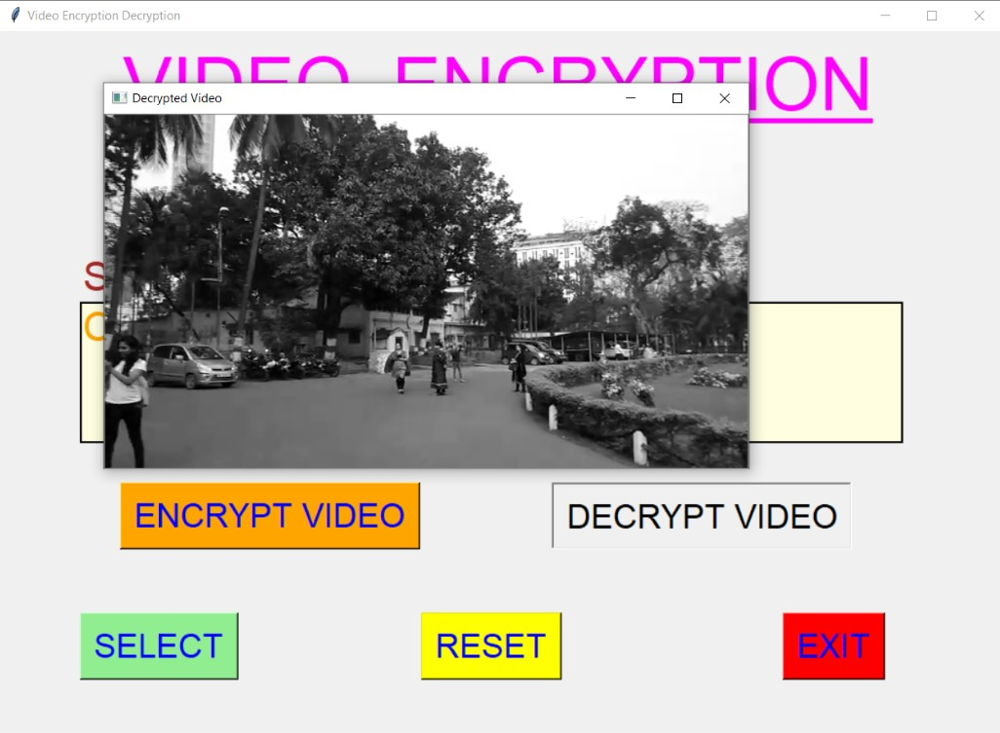
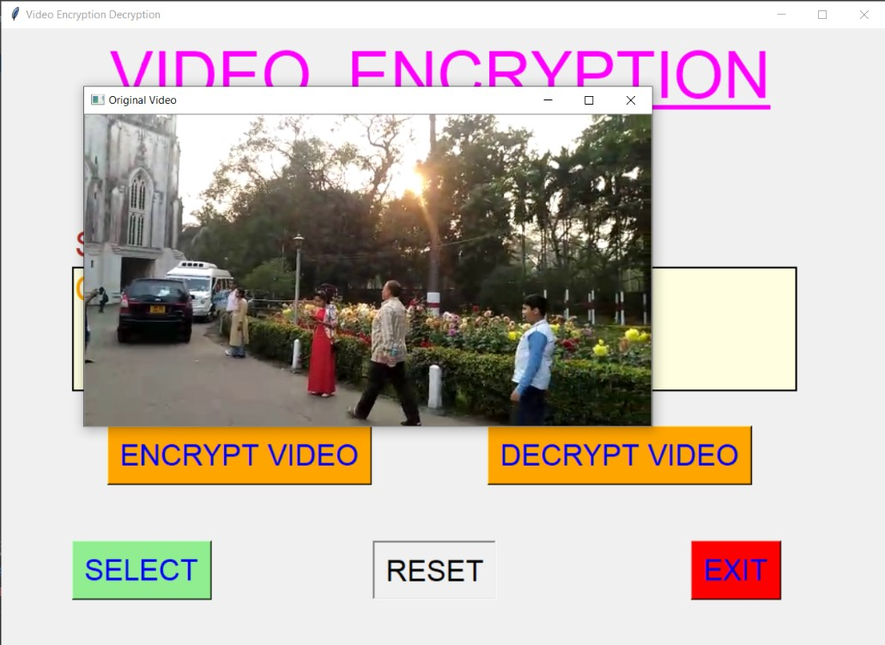
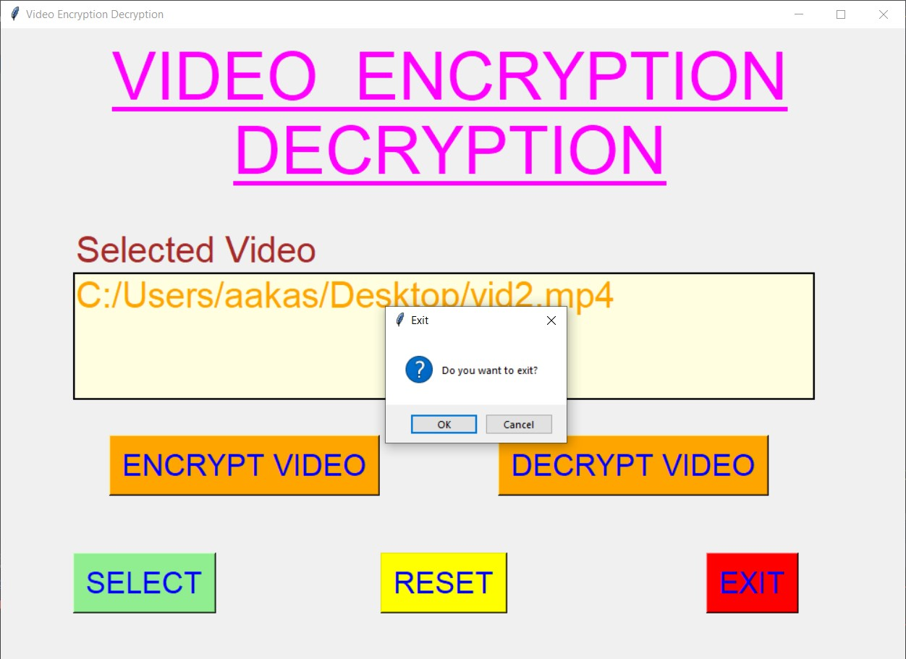

## ✔ VIDEO ENCRYPTION DECRYPTION
- An Video Encryption Decryption is an application created in python with tkinter gui and OpenCv library.
- In this application user can select any video (either mpy, mkv, avi, or any other extension of video) and will be able to encrypt, decrypt and reset the encrypted video to original format.
-  Along with encryption, decryption, user will also be able to see the preview of encrypted, decrypted and original video.

	
	
	
	

	
	
	
	

	
	
	
	

	
	
	
	
	
	

	

****

### 📌REQUIREMENTS :
- python 3
- tkinter module
- filedialog from tkinter
- messagebox
- from PIL import Image, ImageTk
- cv2
- numpy
- os
- random
- moviepy

****

### 📌HOW TO Use it :
- User just need to download the file, and run the video_encryption_decryption.py, on local system.
- After running a GUI window appears, where user can start the video encryption decryption application by clicking on the START button.
- After that a new GUI window will open, in which user will have buttons like SELECT, ENCRYPT VIDEO, DECRYPT VIDEO, RESET and EXIT.
- User can select any video file (either mpy, mkv, avi, or any other extension of video) from the local system, using SELECT button.
- After user has selected video, user will be able to see the path of the video selected in the text area.
- After this, when user clicks on the ENCRYPT VIDEO button, the encryption process will start and user will be shown an encrypted video as a preview.
- After that user can decrypt the encrypted video, using DECRYPT VIDEO which will show decrypted video as a preview.
- Also there is a RESET button, clicking on which user can reset the video to original format, which will show the preview for the same.
- Also there is an EXIT button clicking opn which user can exit from the application.

### 📌Purpose :
- This scripts helps user to easily to encrypt, decrypt or reset to original format by selecting any video from local system.

### 📌Compilation Steps :
- Install tkinter, PIL, cv2, numpy, os, random, moviepy
- After that download the code file, and run video_encryption_decryption.py on local system.
- Then the script will start running and user can explore selecting any video and encrypting and decrypting it and seeing the preview for the same.

****

### 📌SCREENSHOTS :

   
   
   
   
   
   
   
   
   

****

### 🌟Stargazers Over Time:

****

### 📌Contributors:

